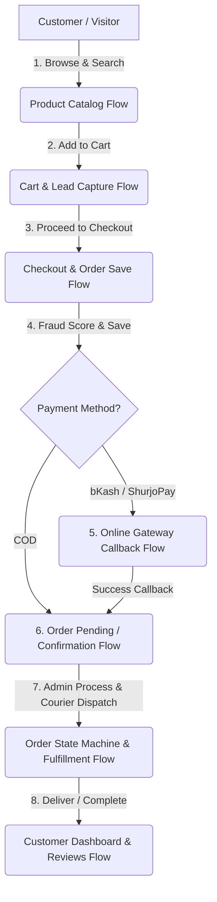

# Phase 05 — Business Flow Mapping

## Objective
Comprehensive end-to-end mapping of all 8 core business flows (Customer Auth, Product Discovery, Cart & Abandonment, Order Checkout, Payment Processing, Order Lifecycle State Machine, Admin POS, Customer Self-Service) in the MondolShopBD application, documenting step sequences, database mutations, external calls, failure scenarios, and refactoring targets.

## Why This Phase Exists
A successful Modular Monolith refactor requires understanding how business data flows across boundaries. Mapping all business flows guarantees that during characterization testing (Phases 09–14) and module extraction (Phases 49–76), critical business logic (e.g. coupon calculations, guest auto-registration, fraud scoring, order status transitions) remains functionally intact without regression.

---

## 1. The 8 Core Business Flows



---

## 2. Detailed Flow Specifications & Sequence Mapping

### Flow 1: Customer Authentication & Verification Flow
- **Entry Points**: `POST /customer/store`, `POST /customer/signin`, `POST /customer/resend-otp`, `POST /customer/verify-account`, `POST /customer/forgot-verify`
- **Execution Path**:
  1. Input validated via inline `$this->validate()` (no FormRequest).
  2. Customer record created with `verify = 1` or `verify = rand(1111, 9999)`.
  3. Plaintext OTP stored directly in `customers.verify` column.
  4. Synchronous `curl_init` to SMS gateway with `CURLOPT_SSL_VERIFYPEER = false`.
  5. Authentication accomplished via `Auth::guard('customer')->attempt(...)`.
- **Target Architecture (Phase 55–59)**: `RegisterCustomerAction`, `SendOtpAction` (Queued), hashed OTP tokens in dedicated `otp_tokens` table.

### Flow 2: Product Discovery & Catalog Browsing Flow
- **Entry Points**: `GET /`, `GET /category/{slug}`, `GET /subcategory/{slug}`, `GET /product/{id}`, `GET /search`, `GET /livesearch`
- **Execution Path**:
  1. Homepage executes 12+ queries sequentially: Banners, Sliders, Hot Deals, Category Tree, Menus, New Arrivals.
  2. Category browsing queries products filtered by `category_id` and status with pagination.
  3. Single product details eager-loads `reviews`, `productimages`, `productsizes`, `productcolors`.
- **Target Architecture (Phase 49–54 & 79)**: `ProductRepository` with selective column projection (`select()`), Redis caching for catalog menus and home collections.

### Flow 3: Cart Management & Incomplete Order Capture Flow
- **Entry Points**: `POST /cart/store`, `GET /incomplete_order`, `GET /cart/increment`, `GET /cart/decrement`, `GET /cart/remove`
- **Execution Path**:
  1. Items added to `Gloudemans\Shoppingcart` session cart (`olimortimer/laravelshoppingcart` abandoned package).
  2. Abandonment lead captured via `/incomplete_order` inserting customer phone, address, and serialized cart into `incomplete_orders` table.
- **Target Architecture (Phase 60)**: `RedisCartService` replacing legacy session package, preserving session resilience across device switches.

### Flow 4: Order Placement & Checkout Flow (`CustomerController::order_save`)
- **Entry Point**: `POST /customer/order-save` (168 lines of procedural code)
- **Execution Path**:
  1. Read cart subtotal, session discount, delivery area shipping fee.
  2. Auto-register guest if not authenticated (`password = rand(111111, 999999)`, `bcrypt`).
  3. Create `orders` row (`invoice_id = rand(11111, 99999)`, `order_status = 1` [Pending]).
  4. Synchronous network call to `Order::fraud_check()` saving risk score in `orders.f_check`.
  5. Create `shippings` and `payments` records.
  6. Loop cart items: create `order_details` records (Stock is NOT deducted here).
  7. Delete `incomplete_orders` record.
  8. Destroy session cart.
  9. Synchronous cURL call to SMS Gateway.
  10. Redirect to bKash / ShurjoPay / COD Success page.
- **Target Architecture (Phase 63)**: `PlaceOrderAction` wrapped in atomic DB Transaction, dispatching domain events for SMS, stock reservation, and payment initiation.

### Flow 5: Payment Processing & Webhook Callbacks Flow
- **Entry Points**: `GET /bkash/checkout-url/callback`, `GET /payment-success`
- **Execution Path**:
  1. Gateway returns `order_id` / `paymentID`.
  2. Execute capture API call via cURL / SDK.
  3. Direct DB update: `payments.payment_status = 'Completed'`, `orders.order_status = 2` (Confirmed).
  4. Destroy session cart and display invoice.
- **Target Architecture (Phase 67–71)**: Idempotent payment webhook handler with atomic signature verification and state machine event dispatch.

### Flow 6: Order State Machine & Fulfillment Flow
- **State Transition Graph**:
  ```
  [1: Pending] ──► [2: Confirmed] ──► [3: Processing] ──► [4: Shipped] ──► [5: Delivered]
        │                │                  │
        ▼                ▼                  ▼
  [6: Cancelled]   [6: Cancelled]     [7: Returned]
  ```
- **Execution Path**:
  1. Admin updates status in `OrderController::order_process` or `updateStatus`.
  2. Status changed in database without transition validation.
  3. SMS notification triggered synchronously.
  4. Pathao / Steadfast courier API dispatched via `order_pathao()` or `bulk_courier()`.
- **Target Architecture (Phase 64 & 72)**: Backed PHP 8.1 `OrderStatus` Enum with explicit `canTransitionTo()` state machine validation and queued fulfillment jobs.

### Flow 7: Admin POS (Point of Sale) Flow
- **Entry Points**: `GET /admin/order/create`, `POST /admin/order/store`
- **Execution Path**:
  1. Products added to `pos_shopping` cart instance.
  2. Admin selects/creates customer, discount, and payment method.
  3. `order_store()` creates order, shipping, payment, and details records.
  4. Immediately decrements product stock (`$product->stock -= $qty`).
- **Target Architecture (Phase 65)**: `CreatePosOrderAction` sharing underlying domain `PlaceOrder` pipeline with atomic stock deduction.

### Flow 8: Customer Self-Service Dashboard & Reviews Flow
- **Entry Points**: `GET /customer/account`, `GET /customer/orders`, `GET /customer/invoice`, `GET /customer/order-track/result`, `POST /customer/post/review`
- **Execution Path**:
  1. Customer reviews order history, views HTML printable invoice.
  2. Public tracking allows lookup by phone or invoice ID.
  3. Customer submits review for product.
- **Target Architecture (Phase 55 & 75)**: Ownership Policy verification on invoice queries (IDOR protection) and verified purchase check before review creation.

---

## 3. Critical Flow Risks & Mitigation Plan

| Business Flow | Identified Risk / Anti-Pattern | Target Mitigation Phase |
|---|---|---|
| **Checkout** | Stock overselling under concurrency (no lock) | Phase 62 (Inventory Ledger & Lock) |
| **Checkout** | Non-atomic mutations across 5 tables without DB transaction | Phase 39 & 63 (PlaceOrder Action + Transactions) |
| **Payment** | Duplicate execution on retry/callback (no idempotency) | Phase 70 (Webhook Idempotency) |
| **Order State** | Invalid state transitions (e.g. Delivered -> Pending) | Phase 64 (Order State Machine Enum) |
| **SMS / Courier**| Synchronous HTTP blocking checkout thread | Phase 38 & 40 (Queue Architecture + Outbox) |

---

## 4. Definition of Done Checklist

- [x] All 8 core business flows mapped end-to-end
- [x] Step sequences, controllers, database mutations, and external calls documented
- [x] State transition graph and validation rules defined
- [x] Concurrency and integrity failure points identified
- [x] Mitigation mapping aligned with Roadmap Phases 38, 39, 49–75
- [x] Ready for Phase 06 (Security Code Audit)

